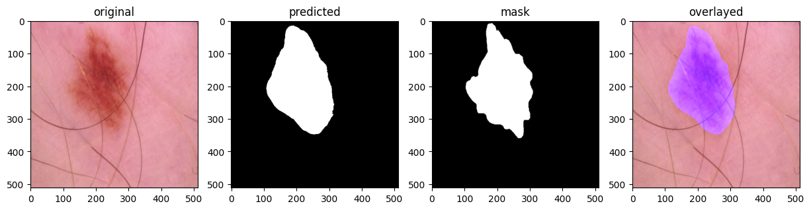
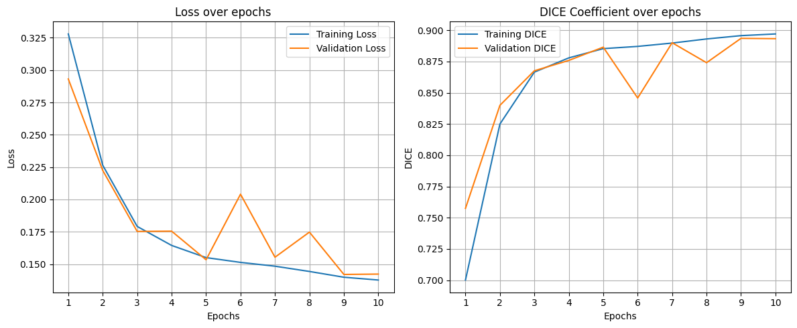
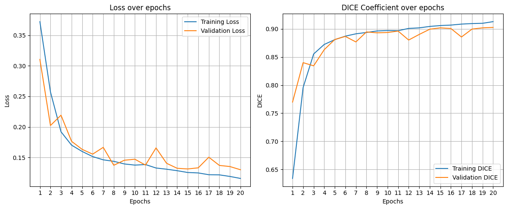
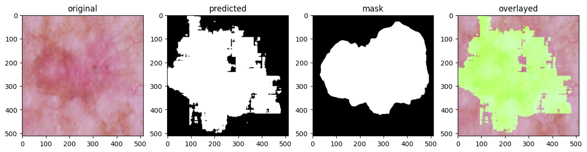

<div align="center">
  <h1>U-Net SKIN CANCER SEGMENTATION<h1>
  
  <h3>Natanael F. G. Vitorino<h3>
  <h3>Eng. da Computação<h3>
  <h4>Facens<h4>
</div>


Recentemente, eu me desafiei a implementar a rede U-Net para aprender como ela funciona e desenvolvi este projeto. O objetivo desse projeto é treinar modelos de segmentação com máscara png. Este trabalho usa o [modelo UNet] (https://arxiv.org/pdf/1505.04597) especializado em segmentação de imagens biomédicas para segmentar cânceres de pele. Usei o conjunto de dados [Skin cancer: HAM10000] (https://www.kaggle.com/datasets/surajghuwalewala/ham1000-segmentation-and-classification/data), uma versão de fácil download do [The HAM10000 dataset, uma grande coleção de imagens dermatoscópicas de múltiplas fontes de lesões cutâneas pigmentadas comuns] (https://doi.org/10.7910/DVN/DBW86T) e treinei o modelo. O conjunto de dados usado consiste em imagens .jpg e máscaras binárias .png. Neste projeto, também estou usando a sobreposição da máscara prevista com a imagem original, o que facilita a compreensão da área afetada pelo câncer de pele. Se você estiver interessado no assunto, fique à vontade para saber mais sobre essa arquitetura. Preparei um notebook fácil de entender e de implementar.

Para o pojeto de AF, gostaria de atacar os principais pontos de evolução deste trabalho, os quais são descritos na seção de próximos passos deste documento. A seguir, exploro a arquitetura do modelo U-Net, apresento a analise inicial dos resultados obtido, realizo a extração da unica métrica abordada para a validação e apresento uma breve conclusão do projeto.


## U-Net Architecture

A arquitetura U-Net alcança um desempenho muito bom em aplicações de segmentação em imagens biomédicas. Arquitetura U-net (exemplo para 32x32 pixels na resolução mais baixa), conforme apresentado na Figura 1. Cada caixa azul corresponde a um mapeamento de características multicanal. O número de canais é indicado na parte superior da caixa. O tamanho x-y é fornecido na borda inferior esquerda da caixa. As caixas brancas representam mapas de características copiados. As setas indicam as diferentes operações. Este trabalho é baseado em [Ronneberger et al] (https://arxiv.org/pdf/1505.04597).

<div align="center">
  <h3>Figure 1<h3>
  
  <h4>Ronneberger et al.<h4>
</div>


## COMO INSTALAR
```sh
conda create -n torch python==3.9
conda activate torch

git clone https://github.com/nata-vito/skin-cancer-segmentation.git
cd skin-cancer-segmentation
pip install -r requirement.txt
```

Você pode encontrar o notebook em ```./notebooks/UNet_skin_cancer_seg.ipynb`` e o modelo [aqui] (https://huggingface.co/natavito/skin_cancer_seg/blob/main/README.md).

## Analise dos Dados

### Métricas
A segunda versão do modelo melhorou em comparação com a primeira, como pode ser visto na imagem abaixo. Os dois modelos são submetidos à mesma imagem para inferência, e a tabela a seguir mostra os resultados da inferência.

A métrica usada para avaliar o modelo foi a pontuação DICE.

Pontuação DICE = 2 * |A ∩ B| / (|A| + |B|)

Pontuação de dados = 2 * (número de elementos comuns) / (número de elementos no conjunto A + número de elementos no conjunto B)

[Coeficiente de dados! O que é isso?](https://medium.com/@lathashreeh/dice-coefficient-what-is-it-ff090ec97bda)


<div align="center">
  <h3>Figure 2<h3>
  
  <h4>https://medium.com/@lathashreeh/dice-coefficient-what-is-it-ff090ec97bda<h4>
</div>

---

### Test Loss e Test DICE
| Model | Test Loss | Test DICE |
| ------------- | ------------- | ------------- |
| skin_cancer_v1.pth | 0.14458022380454671 | 0.8940358493063185 |
| skin_cancer_v2.pth | **0.13620347219208875** | **0.9024439165516506** |

---

### Resultados da Inferência

| Model | Image | DICE Coeficient |
| ------------- | ------------- | ------------- |
| skin_cancer_v1.pth | ISIC_0033463.jpg | 0.95799 |
| skin_cancer_v1.pth | ISIC_0026023.jpg | 0.79981 |
| **skin_cancer_v1.pth** | ISIC_0029811.jpg | **0.79044** |
| **skin_cancer_v1.pth** | ISIC_0029382.jpg | **0.90416** |
| skin_cancer_v1.pth | ISIC_0032059.jpg | 0.80779 |

| Model | Image | DICE Coeficient |
------------- | ------------- | ------------- |
| **skin_cancer_v2.pth** | ISIC_0033463.jpg | **0.96696** |
| **skin_cancer_v2.pth** | ISIC_0026023.jpg | **0.89177** |
| skin_cancer_v2.pth | ISIC_0029811.jpg | 0.74671 |
| skin_cancer_v2.pth | ISIC_0029382.jpg | 0.85114 |
| **skin_cancer_v2.pth** | ISIC_0032059.jpg | **0.87269** |

---

### Análise dos dados
Ao analisar os gráficos de loss e DICE, podemos ver que, da época 12 à 20, o modelo não aprendeu muito, mas houve uma pequena melhoria nos coeficientes.

<div align="center">
  <h3>Figure 3<h3>
  
  <h4>Validation Results for model version 1<h4>
</div>

<div align="center">
  <h3>Figure 4<h3>
  
  <h4>Validation Results for model version 2<h4>
</div>

---

<div align="center">
  <h3>Model: skin_cancer_v1.pth<h3>
  <h3>ISIC_0033463.jpg<h3>
  
  <h3>ISIC_0026023.jpg<h3>
  
  <h3>ISIC_0029811.jpg<h3>
  
  <h3>ISIC_0029382.jpg<h3>
  
   <h3>ISIC_0032059.jpg<h3>
  
</div>


---


<div align="center">
  <h3>Model: skin_cancer_v2.pth<h3>
  <h3>ISIC_0033463.jpg<h3>
  
  <h3>ISIC_0026023.jpg<h3>
  
  <h3>ISIC_0029811.jpg<h3>
  
  <h3>ISIC_0029382.jpg<h3>
  
   <h3>ISIC_0032059.jpg<h3>
  
</div>


### Conclusão
Os experimentos conduzidos demonstram que a arquitetura U-Net é uma abordagem eficaz para a segmentação de câncer de pele em imagens biomédicas. Os resultados obtidos indicam que a segunda versão do modelo superou a primeira, evidenciado por uma redução na função de perda e um aumento na pontuação DICE. Essa melhoria está diretamente relacionada ao maior número de épocas de treinamento, permitindo um aprendizado mais profundo das características das lesões. No entanto, a análise das curvas de loss e DICE revelou que, após a 12ª época, os ganhos em desempenho foram marginais, sugerindo a necessidade de otimizações mais avançadas no treinamento do modelo.


### Próximos Passos
Para aprimorar o desempenho do modelo de segmentação, faz-se necessário um refinamento no processo de fine-tuning. Isso inclui a experimentação com diferentes hiperparâmetros, como taxa de aprendizado, otimizadores (Adam, RMSprop, SGD) e funções de perda adequadas para segmentação. Além disso, será analisado o impacto do aumento do número de épocas no treinamento, buscando um equilíbrio entre a melhoria da acurácia e a mitigação do overfitting. Técnicas como early stopping e learning rate scheduling serão empregadas para otimizar o processo de aprendizado e garantir a melhor convergência do modelo dentro de um tempo computacional razoável.


Outra etapa fundamental consiste na avaliação comparativa de diferentes arquiteturas de segmentação. Além da U-Net, serão testadas redes como DeepLabV3+, FPN (Feature Pyramid Network) e SegFormer, que apresentam avanços na extração de características espaciais e contexto semântico. Cada uma dessas arquiteturas será treinada sob condições semelhantes para possibilitar uma comparação justa, e seus desempenhos serão analisados com base em métricas padronizadas. Essa análise permitirá a identificação do modelo mais eficiente para a tarefa de segmentação de câncer de pele, levando em consideração tanto a precisão quanto a capacidade de generalização.


Por fim, será conduzida uma avaliação mais abrangente da qualidade das segmentações por meio da incorporação de métricas adicionais, como Intersection over Union (IoU), Sensibilidade, Especificidade e Matriz de Confusão. O uso dessas métricas fornecerá uma visão mais detalhada do comportamento do modelo, permitindo identificar possíveis vieses e limitações. Além disso, serão aprimoradas as técnicas de visualização dos resultados, incluindo gráficos mais detalhados sobre a evolução do treinamento e a sobreposição das máscaras preditas nas imagens originais. Com essas melhorias, espera-se obter um modelo mais robusto e confiável para aplicações práticas na detecção e segmentação de câncer de pele.


## 🤝 Autor

Gostaríamos de agradecer às seguintes pessoas que contribuíram para este projeto:

<table>
  <tr>
    <td align="center">
      <a href="#">
        <br>
        <sub>
          <b>Natanael Vitorino</b>
        </sub>
      </a>
    </td>
  </tr>
</table>


## 📝 License

Este projeto está sob licença. Consulte o arquivo [LICENSE](LICENSE) para obter mais detalhes.

---
