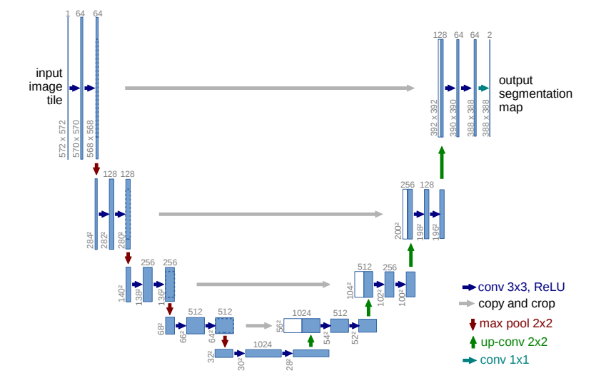

# U-Net for Skin Cancer Segmentation


The aim of this project is to train segmentation models with png mask. This work uses [UNet model](https://arxiv.org/pdf/1505.04597) specialized in biomedical image segmentation in order to segment skin cancers. We used the dataset [Skin cancer: HAM10000](https://www.kaggle.com/datasets/surajghuwalewala/ham1000-segmentation-and-classification/data), a easy download version of [The HAM10000 dataset, a large collection of multi-source dermatoscopic images of common pigmented skin lesions](https://doi.org/10.7910/DVN/DBW86T) and trained the network. The dataset consists of .jpg images and .png binary masks.


## U-Net Architecture

The u-net architecture achieves very good performance on very different biomedical segmentation applications. U-net architecture (example for 32x32 pixels in the lowest resolution) as presented in Figure 1. Each blue box corresponds to a multi-channel feature map. The number of channels is denoted on top of the box. The x-y-size is provided at the lower left edge of the box. White boxes represent copied feature maps. The arrows denote the different operations. This work is based on [Ronneberger et al](https://arxiv.org/pdf/1505.04597).


Figure 1




## HOW TO INSTALL
```sh
conda create -n torch python==3.9
conda activate torch

git clone https://github.com/nata-vito/skin-cancer-segmentation.git
cd skin-cancer-segmentation
pip install -r requirement.txt
```

You can find the notebook in ```./notebooks/UNet_skin_cancer_seg.ipynb```

## 🤝 Collaborators

We would like to thank the following people who contributed to this project:

<table>
  <tr>
    <td align="center">
      <a href="#">
        <br>
        <sub>
          <b>Natanael Vitorino</b>
        </sub>
      </a>
    </td>
  </tr>
</table>


## 📝 License

This project is under license. See the file [LICENSE](LICENSE) for more details.

---
